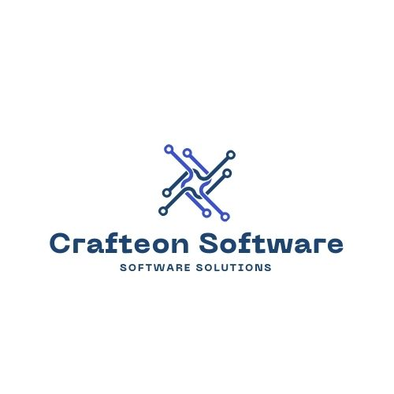

# Welcome to Crafteon Software! 👋

**Crafting Innovative Software Solutions**

At Crafteon Software, we are a newly established and dynamic software company passionate about building cutting-edge solutions. We are dedicated to developing both our own innovative projects and providing bespoke software services to help businesses thrive in the digital age.

## About Us 🚀

Crafteon Software was founded with a vision to:

*   **Develop and launch our own exciting software products.** We believe in creating solutions that solve real-world problems and push the boundaries of technology.
*   **Partner with clients to deliver exceptional software services.**  We are committed to understanding our clients' unique needs and crafting tailored software solutions that drive their success.
*   **Foster a culture of innovation and continuous learning.** We are a team of enthusiastic and skilled professionals dedicated to staying ahead of the curve in the ever-evolving tech landscape.

We are more than just a software company; we are **craftsmen of digital experiences.** We take pride in the quality, creativity, and effectiveness of our work.

## What We Do 🛠️

Crafteon Software specializes in:

*   **Custom Software Development:** We build tailor-made software applications to address specific business challenges. Whether you need a web application, mobile app, or a complex enterprise system, we've got you covered.
*   **Web Application Development:** We create robust and user-friendly web applications that are scalable and meet modern web standards.
*   **Mobile Application Development:** We develop native and cross-platform mobile applications for iOS and Android platforms, ensuring seamless user experiences on mobile devices.
*   **Software Consulting:**  We offer expert guidance and consulting services to help businesses navigate their software needs, from technology strategy to implementation.

## Our Vision ✨

Our vision is to become a trusted and respected leader in the software industry, recognized for:

*   **Innovation:**  Continuously developing novel and impactful software solutions.
*   **Quality:** Delivering high-quality, reliable, and performant software.
*   **Client Success:**  Helping our clients achieve their business goals through effective technology solutions.
*   **Growth:** Expanding our team, our portfolio, and our impact in the software world.

## Let's Connect! 🤝

We are always open to new opportunities, collaborations, and conversations.

**Contact Us:**

*   **Website:** crafteonsoftware.com
*   **Email:** crafteonsoftware@gmail.com

Thank you for visiting our GitHub profile and learning about Crafteon Software. We look forward to crafting the future of software with you!

---